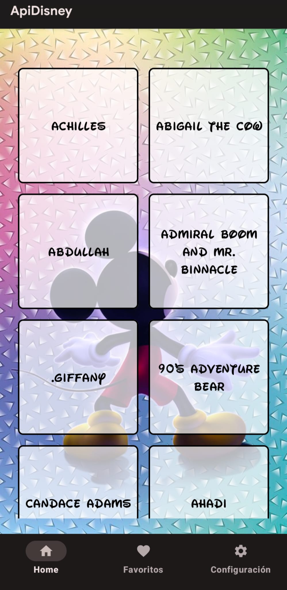
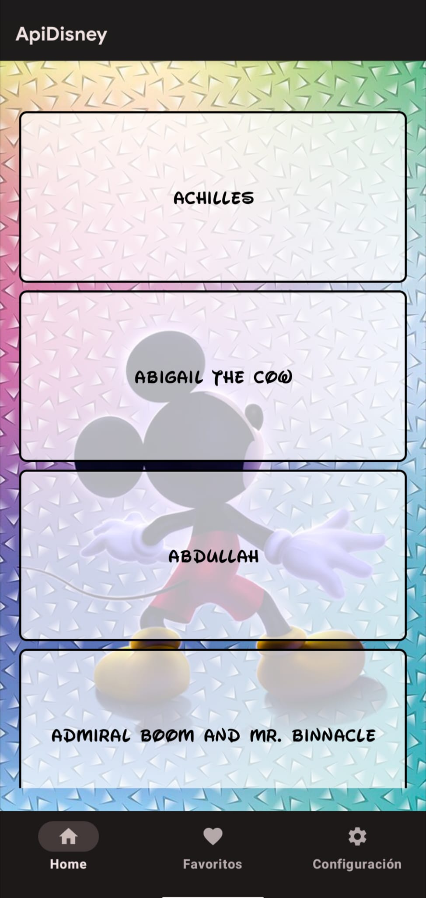
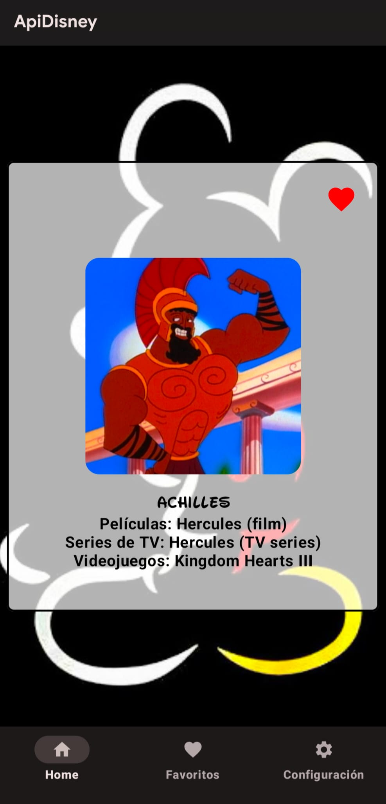
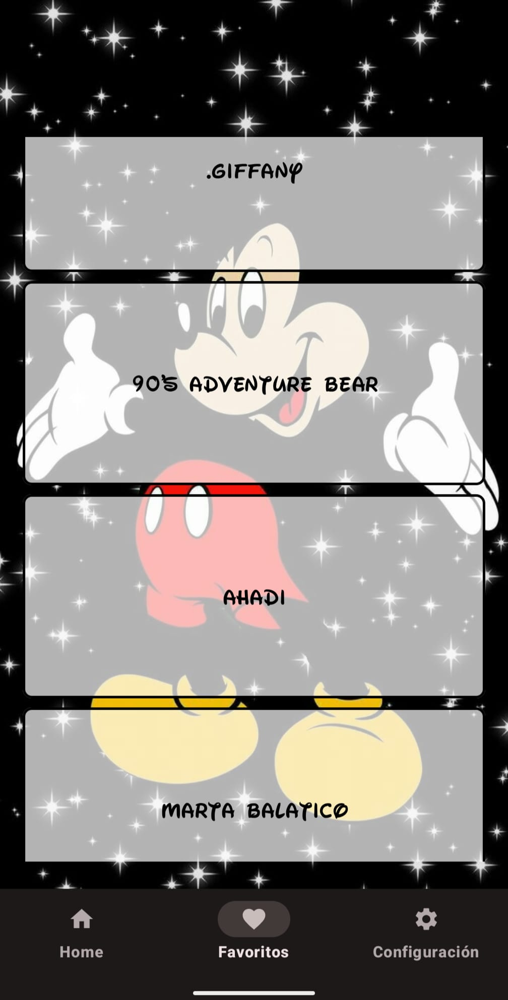
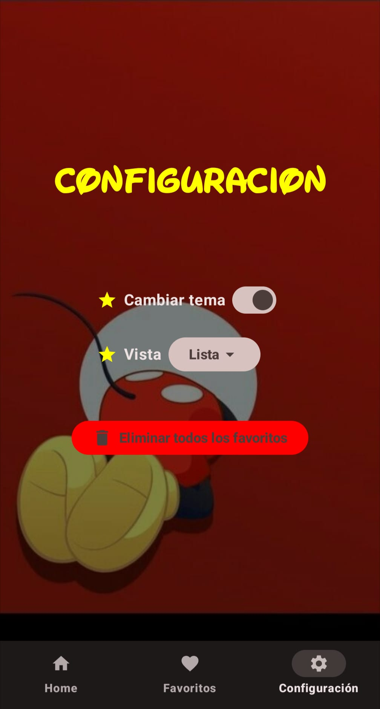

# ApiDisney 

**ApiDisney** es una aplicación móvil nativa para Android enfocada en explorar el universo de personajes de Disney. Este proyecto escolar destaca por integrar una arquitectura robusta orientada a componentes modernos de Android, gestionando de forma eficiente el consumo de servicios web, la persistencia en bases de datos locales y la reactividad de la interfaz.

---

##  Resumen del Proyecto

* **Problema/Desafío**: Consumir datos externos de una API pública de manera asíncrona, garantizando que la aplicación sea capaz de almacenar información de forma local y recordar las preferencias estéticas elegidas por el usuario entre sesiones.
* **Propósito**: Activar un flujo de arquitectura limpia (MVVM) donde se combinan peticiones de red en tiempo real con una base de datos local persistente.

---

##  Características Principales

* **Consumo de API REST (Retrofit)**: Integración con la API pública de Disney para consultar dinámicamente personajes, detalles de películas, series de televisión y videojuegos.
* **Persistencia Local de Favoritos (Room Database)**: Los personajes marcados con el botón de corazón se almacenan de forma local en una base de datos SQLite gestionada a través de **Room**, lo que permite consultarlos incluso sin conexión a internet.
* **Persistencia de Configuración (DataStore)**: El estado del tema visual (Claro/Oscuro) y la disposición de la interfaz (Vista de Rejilla o Lista) se guardan en **Jetpack DataStore Preferences**, asegurando que los ajustes del usuario permanezcan al reiniciar la app.
* **Carga de Imágenes Eficiente (Coil)**: Procesamiento y renderizado asíncrono de las imágenes de los personajes mediante Coil, optimizando la memoria y gestionando la caché del dispositivo.
* **Flujo de Navegación Seguro**: Implementación de **Jetpack Compose Navigation** para transiciones fluidas entre la pantalla principal, los detalles del personaje y el panel de configuración.

---

##  Core Tecnológico

####  Mobile Development & UI
* 
* 
* 

  

    <h3> Networking & Async</h3>
    <ul>
      <li><strong>Retrofit & Gson:</strong> Cliente HTTP y parseo automático de estructuras JSON.</li>
      <li><strong>OkHttp Logging Interceptor:</strong> Monitorización y depuración de peticiones de red.</li>
      <li><strong>Kotlin Coroutines:</strong> Gestión de hilos asíncronos para tareas en segundo plano (peticiones de red y consultas a base de datos).</li>
    </ul>
  

  

    <h3> Storage & Architecture</h3>
    <ul>
      <li><strong>Room DB (SQLite):</strong> Almacenamiento local estructurado para la gestión de favoritos.</li>
      <li><strong>DataStore Preferences:</strong> Guardado síncrono/asíncrono de configuraciones de usuario mediante flujos reactivos.</li>
      <li><strong>MVVM Architecture:</strong> Separación de responsabilidades con ViewModels, States y LiveData.</li>
    </ul>
  

---

## Demostración y Capturas de la Aplicación

  <h3 Vídeo Demostrativo de la App</h3>
 https://github.com/user-attachments/assets/3daa6122-3628-4c1a-89c5-7e31f028986e
  
<em>Exploración de personajes, alternancia de vistas (Grid/Lista) y sistema de favoritos en tiempo real.</em>

 

  
  
  
   
  
  

---

##  Autor

* **Michelle Carolina Posligua Contreras** (Desarrollo Android / Fullstack)
* **Institución**: Institut Tecnològic Barcelona (ITB)
